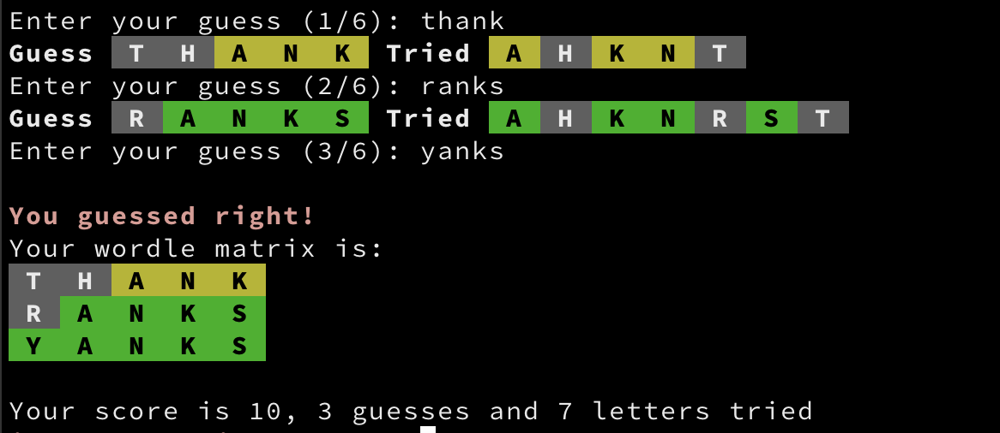

# Wordle

A terminal Wordle written in Go.

Modified from the original (AshishShenoy/wordle), which I was very excited to find. Most of my Go work on Github is done
to explore how to implement code in a way that works for me. The original works great but having worked with languages
having classes for so long I have an easier time dealing with structs than the maps and arrays in the project this one
is forked from.

I added a list of letters tried and their matching status. I think I have correctly implemented colouring of letters in
guessed words, including when there are two of a letter in a guess but only one of the letter in the word to guess.



## Building

There is a Taskfile.yml file included in this project. You can build using `task
build`, and if you have a `~/bin` directory you can build using `task install`.

## Running

You need go 1.16+ installed to allow embedding.

```
go run wordle.go
```

## Options

```
% wordle -h
Usage: wordle [--tries TRIES] [--show] [--blank] [--hideanswer] [--useanswer USEANSWER]

Options:
  --tries TRIES, -t TRIES
                         number of tries [default: 6]
  --show, -s             show word
  --blank, -b            show try results with no letters
  --hideanswer, -H       hide answer at end if not guessed
  --useanswer USEANSWER, -u USEANSWER
                         use provided answer
  --help, -h             display this help and exit
  ```

## Additions

The list of letters tried so far are displayed on each try's line.

## Issues

Have to play this a while to see if there are any inconsistencies.