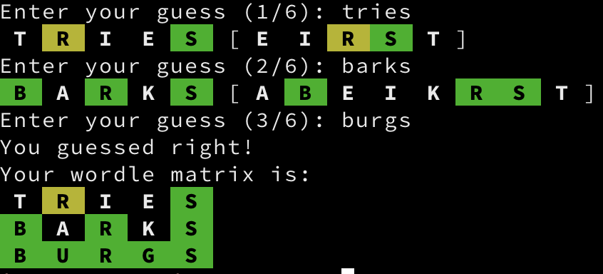

# Wordle

A terminal Wordle written in Go.

Modified a bit to use standard go style, to use an embedded word list, to avoid
duplication of word lists. The logic to do the colouring and the storing of the
colour data is great and I did not really touch that.



## Running

If you couldn't tell from the image, you need Go installed and then run:

```
go run wordle.go
```

## Options

```
% wordle -h                                                                                                   <master ✗>
Usage: wordle [--tries TRIES]

Options:
  --tries TRIES, -t TRIES
                         number of tries [default: 6]
  --help, -h             display this help and exit
```

## Additions

The list of letters tried so far are displayed on each try's line.

## Issues

Have to play this a while to see if there are any inconsistencies.